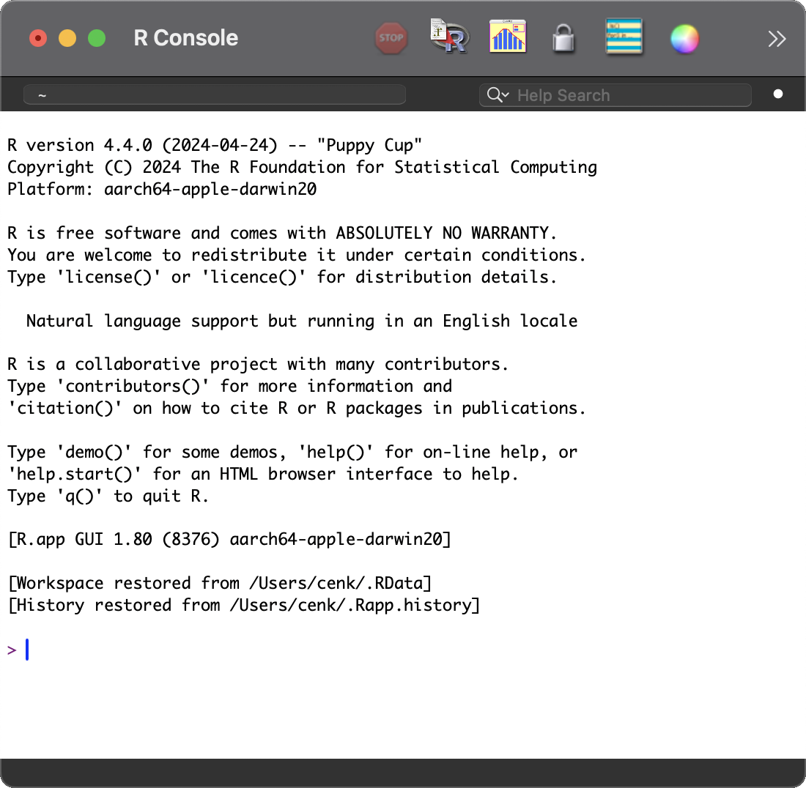

# Bilimler Köyü

## ATGC Sanatı
### Genetik data analizi ve görselleştirme

Bu kılavuz, kurs sırasında yaşanabilecek sorunları engellemek adına bir ön hazırlık sürecini tarif eder. Köyde, internete erişimin kısıtlı olması nedeniyle bu basamakları kursa gelmeden tamamlamış olmanız kurs süresince sorunsuz ilerleyebilmemiz için gereklidir.

#### Gerekli Programların Kurulumu
Kurs içerikleri, açık kaynaklı olan R istatistiksel programlama dili üzerinden gerçekleştirilmek üzere tasarlanmıştır. Bu yüzden önce R kurulumu, ardından da daha sezgisel bir arayüze sahip olan RStudio kurulumunu gereklidir.

##### _R_ kurulumu
R websitesi üzerinden bilgisayarınızın işletim sistemine uygun versiyonu indirin. Kurulum süreci, herhangi bir program kurulumundan farksızdır. İşletim sistemine uygun kurulumu tamamlayın.
- https://cloud.r-project.org/

##### _RStudio_ kurulumu
Benzer bir şekilde, RStudio kurulumunu tamamlayın. Aşağıdaki adresten “Open Source Edition” indirin ve yükleyin.
- https://posit.co/products/open-source/rstudio/

##### Gerekli Kütüphanelerin Kurulumu
1. _R_ uygulamasını başlatın.
Aşağıdaki gibi bir arayüz açılacaktır. Bu arayüz üzerinden yüklenmesi uzun sürecek ve onlarca bağımlılığı olan kütüphaneleri yükleyeceğiz. 

2. “>” imlecinin olduğu satıra aşağıdaki aşağıdaki bağlantıdan sağ tıklayıp indirdiğiniz dosyayı sürükleyin ve enter’a basın:
- [00_gerekli_kutuphaneler.R](https://raw.githubusercontent.com/cenk-celik/bilimler_koyu_atgc/main/00_gerekli_kutuphaneler.R)

##### Gerekli Verinin İndirilmesi
Kurs boyunca erişime açık, oldukça kapsamlı bir meme kanseri veri seti kullanacağız. Veri seti oldukça büyük olduğundan kurs öncesinde indirmeniz önerilir.

1. “>” imlecinin olduğu satıra aşağıdaki aşağıdaki bağlantıdan sağ tıklayıp indirdiğiniz dosyayı sürükleyin ve enter’a basın:
- [01_verileri_indirme.R](https://raw.githubusercontent.com/cenk-celik/bilimler_koyu_atgc/main/01_verileri_indirme.R)

Bu basamakların herhangi birinde bir sorunla karşılaşırsanız, kurs gününden önce [e-posta](mailto:cenk.celik@ucl.ac.uk) ile sorununuzu tanımlayıp ekran görüntüsü ve R konsolunda çıkan hata çıktısını gönderebilirsiniz. Kursta kullanacağımız diğer kütüphanelerin kurumu kısa süreceğinden kurs sırasında gösterilecektir.

Görüşmek üzere,

Cenk
